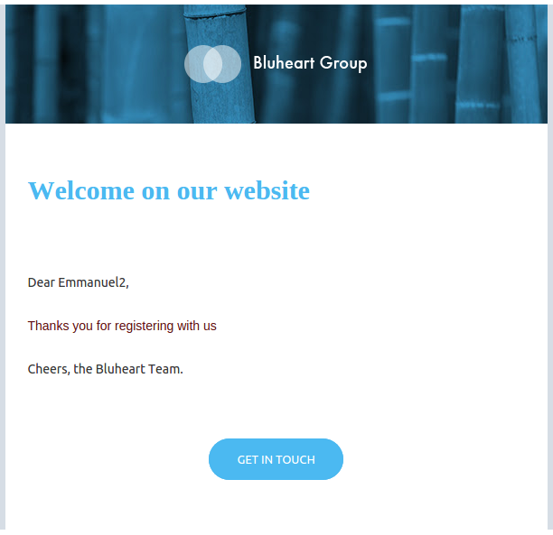
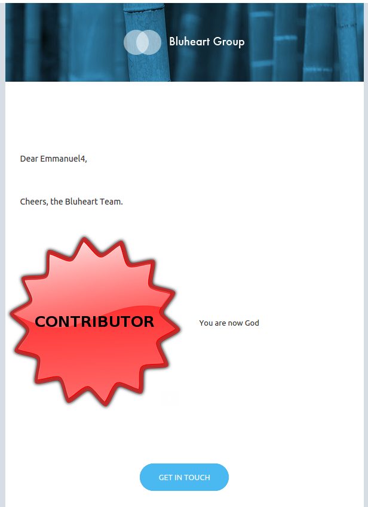
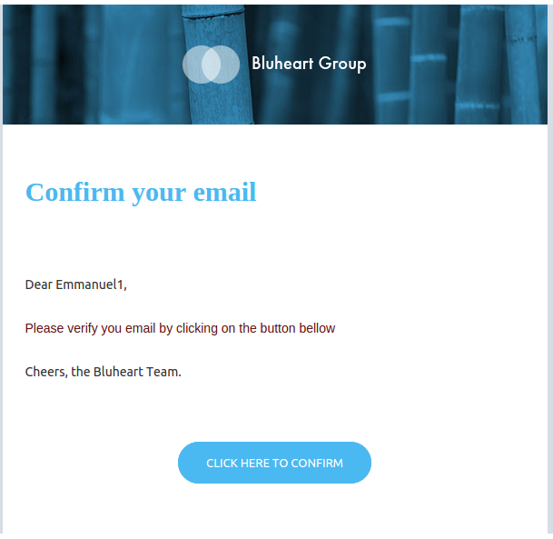
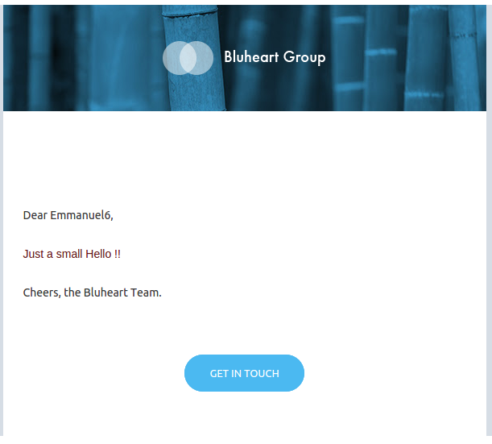

#ALL IN ONE TRANSACTIONAL EMAIL 

This example show how with one single template you can manage a unique canvas for all your small transactional emails

This example handle : 

 - Registration confirmation message
 - Email verification message 
 - third day after registration message
 - custom message
 - Badge / Gamification notification

## Vars 

```
"Vars" => array( 
	"firstname" => "Emmanuel",
	"step" => "badge", 
	"badge" => "writer",
	"level" => 1,
	"messagecontent" => "hi!!",
)
```

## Results

###Vars
```
"Vars" => array( 
	"firstname" => "Emmanuel2",
	"step" => "registration", 
)
```
###Result




###Vars
```
"Vars" => array( 
	"firstname" => "Emmanuel4",
	"step" => "badge", 
	"badge" => "contributor",
	"level" => 4,
)
```
###Result




###Vars
```
"Vars" => array( 
	"firstname" => "Emmanuel1",
	"step" => "confirmation", 
)
```
###Result




###Vars
```
"Vars" => array( 
	"firstname" => "Emmanuel6",
	"step" => "message",
	"messagecontent" => "Just a small Hello !!"
)
```
###Result




