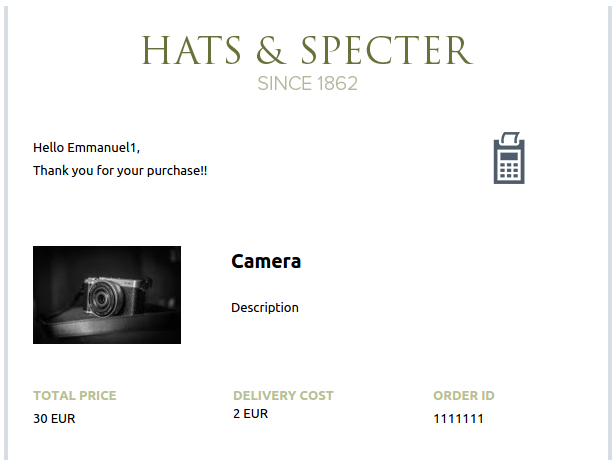
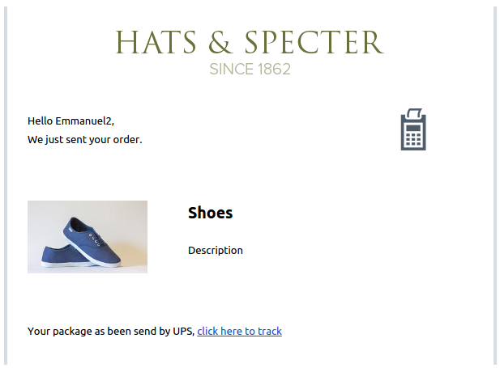
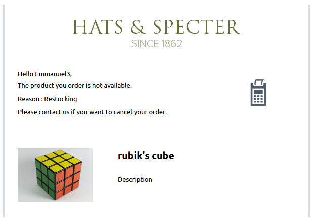
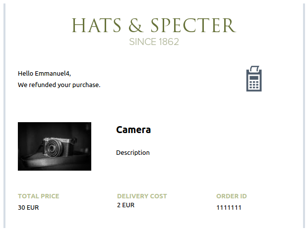
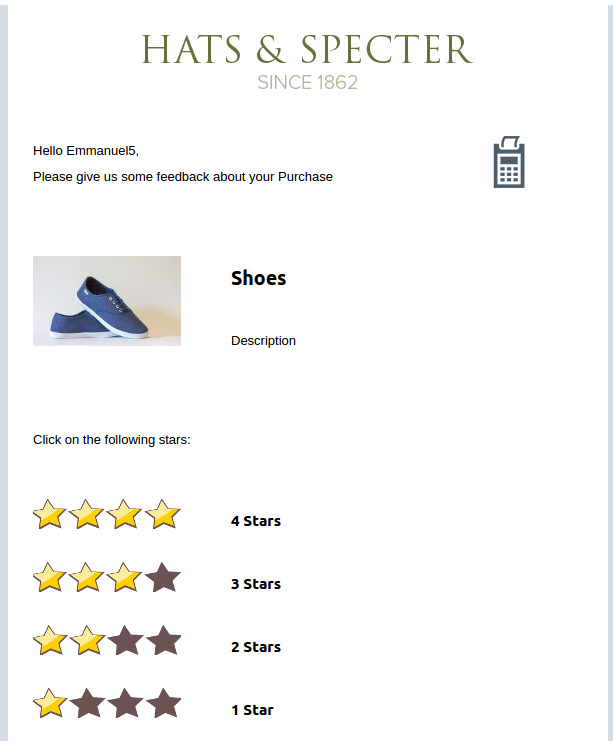

#Ecommerce 

This example can be used to handle the different steps of a online purchase :

 - Confirmation of purchase
 - Confirmation of shipping
 - Unavailability notice
 - Refund confirmation
 - Feedback email (sent after delivery) 

In the test.php script, you can see that the subject also rely on templating language:

```
{{ var:firstname }}, Confirmation of purchase: {{ var:productname:"" }}Your {{ var:productname:"" }} is coming your wayYour purchase is unavailable: {{ var:productname:"" }}Refund of your purchase {{ var:productname:"" }}Please give us some feedback about your {{ var:productname:"" }}
```


## Result

###Vars
```
"Vars" => array( 
					"firstname" => "Emmanuel1",
					"step" => "confirmorder", 
					"productname" => "Camera", 
					"productdescription" => "Description",
					"productimg" => "https://raw.githubusercontent.com/eboisgon/mailjet-template-api-samples/master/ecommerce/img/photo1.jpg", 
					"order_id" => "1111111",
					"delivery" => "2 EUR",
					"total_price" => "30 EUR"
				)
```
###Result




###Vars
```
"Vars" => array( 
					"firstname" => "Emmanuel2",
					"step" => "confirmshipping", 
					"productname" => "Shoes", 
					"productdescription" => "Description",
					"productimg" => "https://raw.githubusercontent.com/eboisgon/mailjet-template-api-samples/master/ecommerce/img/photo2.jpg", 
					"deliverytrackurl" => "#", 
					"delivery" => "UPS",
				)
```
###Result




###Vars
```
"Vars" => array( 
					"firstname" => "Emmanuel3",
					"step" => "unavailable",
					"reasonunavailable" => "Restocking",
					"productname" => "rubik's cube", 
					"productdescription" => "Description",
					"productimg" => "https://raw.githubusercontent.com/eboisgon/mailjet-template-api-samples/master/ecommerce/img/photo3.jpg", 
				)
```
###Result




###Vars
```
"Vars" => array( 
					"firstname" => "Emmanuel4",
					"step" => "refund", 
					"productname" => "Camera", 
					"productdescription" => "Description",
					"productimg" => "https://raw.githubusercontent.com/eboisgon/mailjet-template-api-samples/master/ecommerce/img/photo1.jpg", 
					"order_id" => "1111111",
					"delivery" => "2 EUR",
					"total_price" => "30 EUR"
				)

```
###Result



###Vars
```
"Vars" => array( 
					"firstname" => "Emmanuel5",
					"step" => "feedback", 
					"productname" => "Shoes", 
					"productdescription" => "Description",
					"productimg" => "https://raw.githubusercontent.com/eboisgon/mailjet-template-api-samples/master/ecommerce/img/photo2.jpg", 
				)

```
###Result


