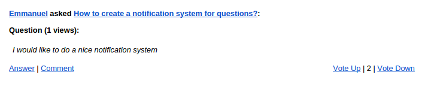
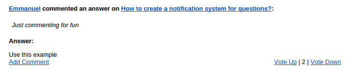

#QUESTION, ANSWER and COMMENT notification (Quandora like)

This example can be used for notification of new question, new comment on a question, new comment on an answer and new answer.

In the test.php script, you can see that the subject also rely on templating language:

```
{{var:author}} commented on  commented an answer on  answered  asked  {{var:question}}
```

## Vars 

```
"Vars" => array( 
					"author" => "Emmanuel",
					"url" => "http://www.example.com",
					"question" => "How to create a notification system for questions?",
					"questiondetail" => "I would like to do a nice notification system",
					"answer" => "",
					"comment" => "",
					"view" => 1,
					"vote" => 2
				)

```

## Template skeleton 

```

 commented on  commented an answer on  answered  asked 
 























```


## Result

###Vars
```
"Vars" => array( 
					"author" => "Emmanuel",
					"url" => "http://www.example.com",
					"question" => "How to create a notification system for questions?",
					"questiondetail" => "I would like to do a nice notification system",
					"answer" => "",
					"comment" => "",
					"view" => 1,
					"vote" => 2
				)
```
###Result




###Vars
```
"Vars" => array( 
					"author" => "Emmanuel",
					"url" => "http://www.example.com",
					"question" => "How to create a notification system for questions?",
					"questiondetail" => "I would like t",
					"answer" => "Use this example",
					"comment" => "Just commenting for fun",
					"view" => 1,
					"vote" => 2
				)
```
###Result




###Vars
```
"Vars" => array( 
					"author" => "Emmanuel",
					"url" => "http://www.example.com",
					"question" => "How to create a notification system for questions?",
					"questiondetail" => "I would like to do a nice notification system",
					"answer" => "",
					"comment" => "Just commenting for fun",
					"view" => 1,
					"vote" => 2
				)
```
###Result


###Vars
```
"Vars" => array( 
					"author" => "Emmanuel",
					"url" => "http://www.example.com",
					"question" => "How to create a notification system for questions?",
					"questiondetail" => "I would like to do a nice notification system",
					"answer" => "Use this example",
					"comment" => "",
					"view" => 1,
					"vote" => 2
				)

```
###Result


