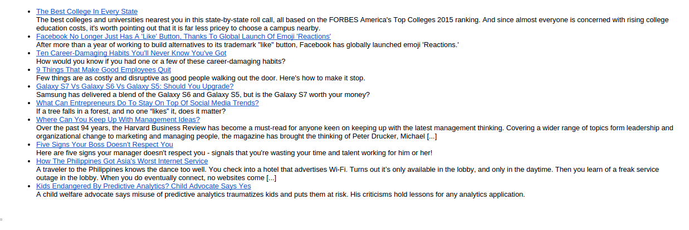

#RSS to EMAIL  

This example show how with the loops you can repeat pieces of your template.

## Vars 

We download a RSS feed from an external source.

## Template source

```html
<ul>

 <li><a href="{{article.link}}">{{article.title}}</a><br>{{article.description}}</li>

</ul>
```

## Result




