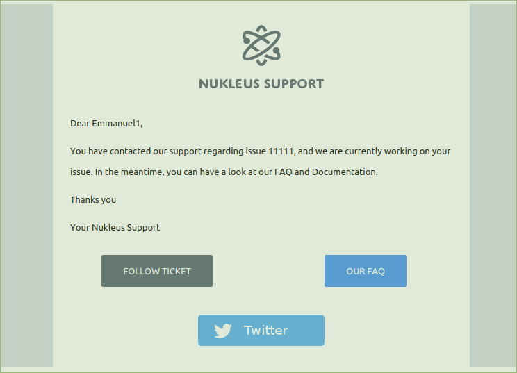
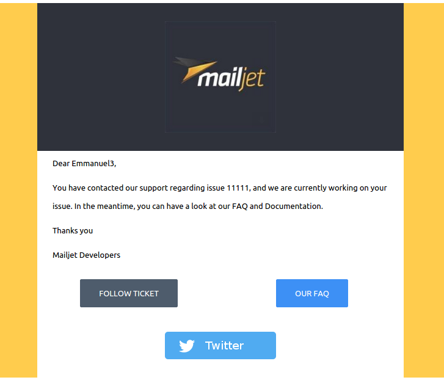

#White Label  

This example can be used to handle several brands on one template or to customize the design depending on the configuration of a software :

 - change colors
 - change base url 
 - change twitter account link 
 - change the logo

## Result

###Vars
```
"Vars" => array( 
					"firstname" => "Emmanuel1",
					"header" => "http://oi08.mjt.lu/img/oi08/b/14ky5/vs3r.png", 
					"header_color" => "#ffffff", 
					"bg_color" => "#d6dde5", 
					"namesupport" => "Your Nukleus Support", 
					"twitter" => "igra_fan", 
					"base_url" => "http://www.mailjet.com", 
					"request_number" => 11111
				)
```
###Result




###Vars
```
"Vars" => array( 
					"firstname" => "Emmanuel2",
					"header" => "https://raw.githubusercontent.com/eboisgon/mailjet-template-api-samples/master/white_label/img/mailjet.jpg", 
					"header_color" => "#2f323b", 
					"bg_color" => "#d6dde5", 
					"namesupport" => "Mailjet", 
					"twitter" => "mailjet", 
					"base_url" => "http://www.mailjet.com", 
					"request_number" => 11111
				)
```
###Result


###Vars
```
"Vars" => array( 
					"firstname" => "Emmanuel3",
					"header" => "https://raw.githubusercontent.com/eboisgon/mailjet-template-api-samples/master/white_label/img/mailjet.jpg", 
					"header_color" => "#2f323b", 
					"bg_color" => "#FFCC4D", 
					"namesupport" => "Mailjet Developers", 
					"twitter" => "mailjetdev", 
					"base_url" => "http://dev.mailjet.com", 
					"request_number" => 11111
				)
```
###Result




